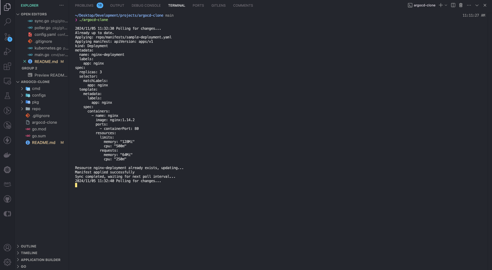
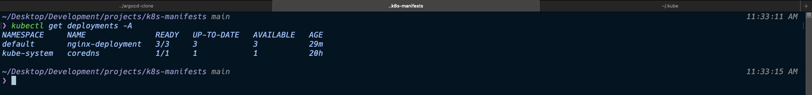

# ArgoCD Clone

An open-source GitOps tool inspired by ArgoCD, designed to automate the deployment of Kubernetes resources directly from a Git repository. This project enables automatic synchronization and application of Kubernetes manifests, making it easy to manage your cluster state as code.




---

## Table of Contents

- [Features](#features)
- [Project Structure](#project-structure)
- [Setup Guide](#setup-guide)
- [Configuration](#configuration)
- [Running the Application](#running-the-application)
- [How It Works](#how-it-works)
- [Troubleshooting](#troubleshooting)
- [Contributing](#contributing)

## Features

- **Automated Sync**: Periodically syncs with a Git repository to detect and apply changes to Kubernetes resources.
- **GitOps-Friendly**: Supports automated and declarative management of Kubernetes manifests.
- **Customizable Poll Interval**: Configurable polling interval to check for Git updates as frequently as you need.
- **Namespace-Aware**: Manages Kubernetes resources within specified namespaces or defaults to `default`.
- **Error Handling**: Handles and logs errors for improved reliability and visibility during sync and apply operations.

---

## Project Structure

```plaintext
├── configs
│   └── config.yaml           # Configuration file with Git and Kubernetes settings
├── pkg
│   ├── gitops
│   │   ├── sync.go           # Main logic for Git synchronization and file handling
│   │   └── poller.go         # Polling mechanism to check for Git changes
│   └── k8s
│       └── kubernetes.go     # Kubernetes client and manifest apply functions
├── main.go                   # Main entry point of the application
└── README.md                 # Project documentation
```

---

## Setup Guide

Follow these steps to set up and run the project on your local machine.

### Prerequisites

Ensure you have the following installed:

- Go (version 1.16 or higher)
- kubectl (for Kubernetes cluster interaction)
- Git (to clone and pull from the repository)
- Kubernetes cluster (Minikube, EKS, etc.)

### Installation

#### 1. Clone the ArgoCD Clone repository:

```bash
git clone https://github.com/tusharbecoding/argocd-clone.git
```

#### 2. Install dependencies:

```bash
go mod tidy
```

#### 3. Create a Kubernetes config file in configs/config.yaml with the following template:

```bash
git:
  repo: "https://github.com/yourusername/your-repo.git"
  branch: "main"
  pollInterval: 60s # Poll interval to check for Git changes
kubernetes:
  kubeconfig: "/path/to/your/kubeconfig" # Path to kubeconfig file

```

## Configuration

The tool's configuration is managed in configs/config.yaml with the following options:

- Git Repository:

  - repo: URL of the Git repository containing Kubernetes manifests.
  - branch: Git branch to monitor for changes.
  - pollInterval: Interval for polling the Git repository for updates (e.g., 60s or 5m).

- Kubernetes Configuration:

  - kubeconfig: Path to your kubeconfig file to connect to the cluster.

---

## Running the Application

#### 1. Run the Application:

```bash
go run main.go
```

The application will initialize, sync with the specified Git repository, and apply any changes in the Kubernetes manifests under repo/manifests within the cluster.

#### 2. Build and Run (Optional):

You can also build the application and run it as an executable:

```bash
go build -o argocd-clone
./argocd-clone
```

#### 3. Log Output:

The application outputs logs to the console, showing sync activity, manifest applications, and any error messages.

#### 4. Checking Deployed Resources:

Once the manifests are applied, you can verify the resources in the Kubernetes cluster using kubectl:

```bash
kubectl get deployments -n <namespace>
kubectl get pods -n <namespace>
```

---

## How It Works

The ArgoCD Clone uses a periodic polling mechanism to fetch updates from a Git repository. When changes are detected, it applies each manifest file found in the repo/manifests directory to the Kubernetes cluster:

1. Sync with Git: Pulls the latest changes from the specified Git repository branch.
2. Apply Manifests: Reads each YAML file and applies it to the Kubernetes cluster using the Kubernetes client libraries.
3. Error Handling: If resources already exist, they are updated; otherwise, new resources are created.

**GitHub Flexer** is open to contributions! If you’d like to add new features, fix bugs, or enhance existing functionality, we welcome your PRs.

### Example Workflow

1. Initial Sync: The application clones the specified repository and applies any YAML manifests under repo/manifests.
2. Periodic Polling: Based on the configured poll interval, the application checks for any changes in the repository.
3. Apply Updates: When new manifests are detected, they are applied to the Kubernetes cluster, creating or updating resources as needed.

---

## Troubleshooting

If you encounter issues, here are some common troubleshooting steps:

- Invalid Manifest: Ensure your YAML manifest files are correctly formatted. Use kubectl apply -f <file> locally to check for errors.
- Kubeconfig Issues: Verify that your kubeconfig path in configs/config.yaml is correct and has the necessary access rights to the cluster.
- Polling Failures: Ensure that Git is properly configured and the repository URL and branch are correct.
- Resource Not Created: Check for existing resources with the same name, as updates might fail if the resource is locked or corrupted.

---

## Contributing

Contributions are welcome! To contribute:

1. Fork the repository.
2. Create a new branch (git checkout -b feature-branch).
3. Commit your changes (git commit -m "Add feature").
4. Push to the branch (git push origin feature-branch).
5. Create a pull request.

Feel free to open issues for bugs or suggest new features. Contributions help improve the project for everyone!
